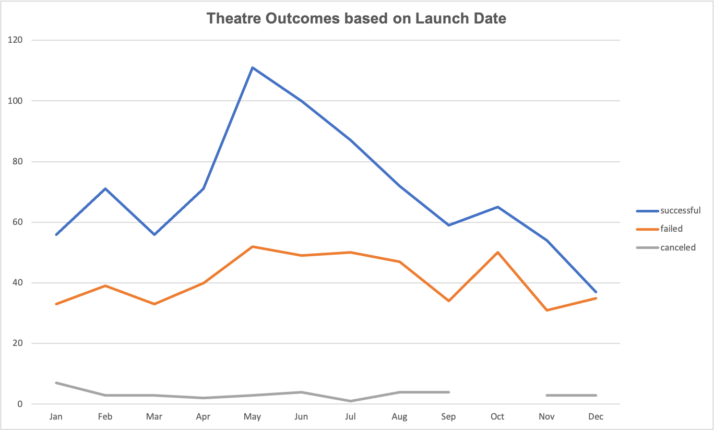
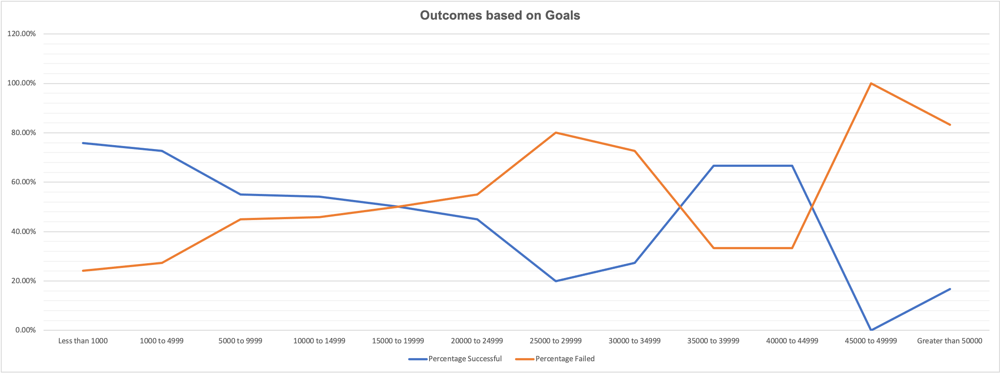

# Kickstarter-Analysis
Performing Analysis on Kickstarter Data on Excel to find trends

## Overview of the project

We used the kickstarter data to perform an analysis of the success of different kickstarter campaigns in comparison to their launch dates and goals. We obtained kickstarter data and performed different types of analyses on the data to reach some meaningful conclusions. 

## Methodology for Analysis

Our first approach was to compare the outcomes of all kickstarter under the “theatre” with the month of the year when they were launched. In order to perform this analysis, we filtered the data for theatre category and created a table which summarises the different outcomes of a campaign (successful, failed and cancelled) for each month of the year. The data is then presented in a chart (screenshot below).

Our second approach was to compare the outcomes of all kickstarter campaigns under the sub-category “plays” and compare them with their goals. In order to do this, we filtered the data for plays sub-category and then created a table which summarises the different outcomes of a campaign (successful, failed and cancelled) for different ranges of goals. The goal ranges are segregated with an interval of $5,000. We then created a line chart to visualize the data (screen shot below)

I have also included the raw data titled [Kickstarter Analysis](Kickstarter_Challenge.xlsx.zip) for your benefit. 

## Challenges Faced

One of the challenges faced was to convert the raw dates of the campaigns into a format that could be easily understood. The launch dates, when extracted from kickstarter, were in unix format which is unreadable. However, we were able to convert them into readable formats using a functionality of excel. 

## Conclusions Drawn

 - Based on our analysis, the month of May appears to be the busiest month in terms of campaign launches under the theater category. Over time, the month of May has the highest number of campaigns launched in a given month. 
 - The month of May also appears to be the most likely month in regards to achieving a successful campaign since the month has the highest number of successful campaigns. 
 - Campaigns which have a target of 5,000 or less appear to be the most successful campaigns. The range 1,000 to 4,999 have the highest number of successful campaigns as well as a very close second, when comparing percentages. 

## Limitations of the dataset

One limitation of the dataset used to compare campaign outcomes with campaign start dates is the category used. We have used the theater category but we would get a better result if we had drilled down further and select the plays sub-category. 

## Other analysis that could have been performed

We could take a subset of the successful campaigns for each goal range and compare the actual funds raised with the goal fund to be raised. We could use that to estimate the amount or percentage by which we are likely to exceed our goal for each goal range. 
